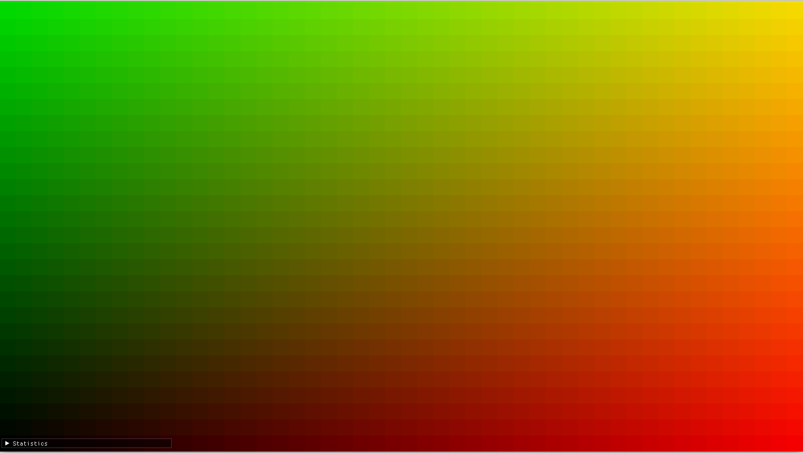

    

# Helios

Helios is a CUDA based ray-tracer.

### You may need to install following
* libxrandr : sudo apt-get install -y libxrandr-dev
* libxinerama : sudo apt-get install -y libxinerama-dev
* libxcursor : sudo apt-get install -y libxcursor-dev
* libxi: sudo apt-get install -y libxi-dev
### Visualising Blocks 

* Following image shows the blocks that compute color for each region of screen.

### Resources

#### Models

* https://www.scratchapixel.com/lessons/3d-basic-rendering/ray-tracing-rendering-a-triangle/ray-triangle-intersection-geometric-solution

#### Code

* General:
  * My own implementation of Ray Tracer in OpenGL shaders.
  * https://github.com/CSE-333-Computer-Graphics-2020
* `Imgui` setup:
  * https://github.com/m516/CV-Sandbox/blob/master/src/03-Hello-ImGui/main.cpp
  * https://github.com/ocornut/imgui
* Drawing a quad using `OpenGL`
  * https://learnopengl.com/Getting-started/Hello-Triangle
* Handling Textures and shaders:
  * https://github.com/JoeyDeVries/LearnOpenGL/blob/master/src/1.getting_started/4.1.textures/textures.cpp 
* CUDA OpenGL interoperability
  * https://github.com/m516/CV-Sandbox/tree/master/src/08-CUDA-and-OpenGL
* Mesh Loading
  * https://assimp-docs.readthedocs.io/en/v5.1.0/usage/use_the_lib.html
  * https://github.com/JoeyDeVries/LearnOpenGL (Model, Mesh, Vertex class from here)
* Ray-Triangle intersection
  * https://www.scratchapixel.com/lessons/3d-basic-rendering/ray-tracing-rendering-a-triangle/ray-triangle-intersection-geometric-solution

